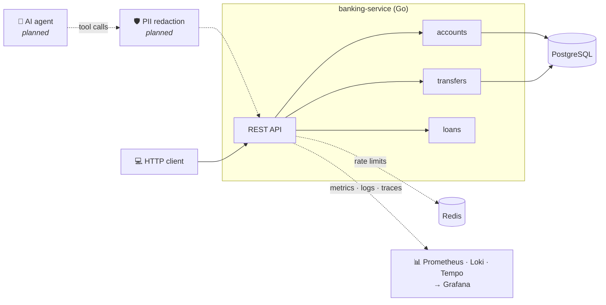

<div align="center">

# 🏦 Bank Agent Platform

**A core banking API in Go, built to be called safely by an AI agent.**

Atomic transfers · Idempotent retries · PII masking · Rate limiting · Full observability


</div>

---

AI agents are starting to call real APIs, and banking is where that gets dangerous. An agent **will** retry after a timeout, **will** fire calls in parallel, and **must never** see a customer's full PAN or Aadhaar number.

This project is the banking backend such an agent would call, designed so that each of those behaviours is safe:

| When the agent... | The API guarantees |
|---|---|
| retries `transfer ₹5,000` after a timeout | the retry returns the original transaction, and money moves once |
| fires many transfers at once | each transfer is atomic: no double spends, no deadlocks |
| loops or floods requests | a per-client token bucket answers `429` with `Retry-After` |
| reads a customer profile | PAN and Aadhaar arrive already masked |
| asks whether a customer can get a loan | tested rules decide; the LLM only explains the decision |
| hits a problem mid-call | its request id leads to the exact trace and log lines |

> ⚠️ All customer data is **synthetic**, generated with Faker. This is a learning and portfolio project, not a production bank.

## Quick start

You need **Docker**, **Go 1.27+** and **Python 3.8+**.

```bash
git clone https://github.com/Aekshant/bank-agent-platform.git
cd bank-agent-platform

cp .env.example .env        # then set POSTGRES_PASSWORD and GRAFANA_ADMIN_PASSWORD
make up-all                 # API, Postgres, Redis and the observability stack

# Load 50 synthetic customers
cd database/seed
python3 -m venv .venv && .venv/bin/pip install -r requirements.txt
.venv/bin/python seed.py
cd ../..
```

| Open | For |
|---|---|
| http://localhost:8001/swagger/index.html | Trying the API in the browser |
| http://localhost:3000 | Dashboards, logs and traces (Grafana) |
| http://localhost:9090 | Metrics and alerts (Prometheus) |

Prefer running the service on your machine? Use `make up` (Postgres and Redis only) and then `make run`.

## Try it

**Send a transfer:**

```bash
curl -X POST localhost:8001/api/v1/accounts/transfer \
  -H "Content-Type: application/json" \
  -d '{"from_account":"customer-001","to_account":"customer-002","amount":5000,"idempotency_key":"tx-123"}'
```

```json
{
  "status": 201,
  "message": "Transfer settled",
  "success": true,
  "data": { "transaction_id": "0884769a-809f-47e4-9b59-404da9ab249c", "status": "SETTLED", "amount": 5000.00 }
}
```

**Send exactly the same request again.** You get `200` and the **same** `transaction_id`. No money moves the second time.

**Read a profile.** PII is masked by the API itself:

```bash
curl localhost:8001/api/v1/accounts/customer-001/profile
```

```json
{
  "customer_id": "customer-001",
  "full_name": "Isaac Bakshi",
  "pan": "XXXXX2768C",
  "aadhaar": "XXXX XXXX 4428",
  "balance": 108145.55,
  "credit_score": 732,
  "is_2fa_verified": true
}
```

### Endpoints

| Method | Endpoint | Purpose |
|---|---|---|
| `GET` | `/api/v1/accounts/{id}/profile` | Customer profile with masked PII |
| `POST` | `/api/v1/accounts/transfer` | Atomic, idempotent transfer |
| `POST` | `/api/v1/loans/evaluate` | Rule-based loan eligibility |
| `GET` | `/health` | Postgres and Redis status |
| `GET` | `/metrics` | Prometheus metrics |

Every response uses the same envelope: `{"status", "message", "success", "data"}`. Every field, status code and error message is in the **[API reference](docs/api.md)**.

## Architecture



PII is protected by **two independent layers**: the API masks it, and a planned redaction layer strips it again before anything reaches an LLM. If one layer has a bug, the other still stops raw identity numbers. More in **[architecture](docs/architecture.md)**.

## How it stays correct

### Transfers are all or nothing

Every transfer is one database transaction: lock both accounts → check for a repeated idempotency key → check the balance → debit → credit → record → commit. Any failure rolls back everything. Three details make this hold up under load:

- **Accounts are locked in id order**, not source-then-destination, so A→B and B→A running together can't deadlock.
- **The idempotency check runs after locking**, so a retry racing the original waits for it, then returns it.
- **A unique constraint on the key** catches the one race the check can't see.

### Retries are safe

Clients send an `idempotency_key` with each transfer and reuse it when retrying. The same key with the same details returns the original transaction; the same key with *different* details is rejected with `409`, because that's a client bug.

### Traffic is limited fairly

Each client IP gets a **token bucket** per endpoint group, stored in Redis and updated by one atomic Lua script. Short bursts are allowed, the sustained rate is capped, and the limit holds across multiple service instances. Clients can't dodge it by faking `X-Forwarded-For`. If Redis goes down, requests are still served ("fails open") and an alert fires.

### Money is never a float

Amounts are `NUMERIC(15,2)` in Postgres and travel as exact decimals. `1.234` is rejected, not rounded.

### Loans are decided by code

Credit score ≥ 650, 2FA verified, and an amount within a score-based multiple of the balance. The response includes `max_eligible_amount`, so the agent can say *how much* a customer could borrow.

Each of these choices, with its trade-offs, is written up in the **[decision records](docs/decisions/)**.

## Observability

Metrics, logs and traces are linked, so a problem can be followed from symptom to cause in a few clicks:


- **Metrics:** request rate, errors and latency per route, plus business metrics: transfers by outcome, rupees moved, loan decisions, rate-limit rejections and database pool usage.
- **Traces:** a span for every request, SQL statement and Redis call. A transfer is 10 spans, from `BEGIN` to `COMMIT`.
- **Logs:** structured JSON; every line carries `request_id` and `trace_id`.
- **Dashboard and 9 alert rules** load automatically when Grafana starts.
- **No customer data in telemetry:** SQL parameters, PAN and Aadhaar are never recorded.

The service ships as a 51 MB distroless image that runs as non-root on a read-only filesystem. Details are in **[infrastructure](infrastructure/README.md)**.

## Tests

```bash
make test-unit            # fast, no database needed
make test-integration     # real HTTP against real Postgres and Redis
make test-load            # fails if any money is created or lost
```

The integration tests prove the guarantees against a real database:

| Scenario | Result |
|---|---|
| 20 identical transfers at the same moment | exactly **1** transfer |
| 100 opposite-direction transfers at the same moment | **no deadlocks**, balances exact |
| 20 concurrent ₹100 debits from a ₹500 balance | exactly **5** succeed, balance **₹0.00** |
| Raw PAN and Aadhaar | **never** present in a response |
| One client bursting past its limit | `429`, other clients **unaffected** |

**Load test** on a laptop: about 2,000 requests per second, p99 around 21 ms, 0 errors, total money unchanged ([benchmarks](docs/benchmarks/)).

Tests create and delete their own customers, so they never touch your data.

## Commands

| Command | Does |
|---|---|
| `make up` | Start Postgres and Redis |
| `make run` | Run the service locally on port 8001 |
| `make up-app` | Run the service in Docker instead |
| `make up-observability` | Start Prometheus, Grafana, Loki, Tempo and Alloy |
| `make up-all` | Everything in Docker |
| `make down` | Stop everything (data is kept) |
| `make seed` | Reset the 50 synthetic customers |
| `make swagger` | Regenerate the Swagger docs |

All settings live in `.env`; [`.env.example`](.env.example) lists them with defaults. See the **[development guide](docs/development.md)** for configuration, troubleshooting and how to add an endpoint.

## Project structure

```
.
├── services/banking-service/    Go service
│   ├── cmd/                     entry point
│   └── internal/                accounts, transactions, loans, ratelimit, observability, ...
├── database/
│   ├── migrations/              schema, applied on first start
│   └── seed/                    synthetic data generator
├── infrastructure/
│   ├── docker/                  Dockerfile, core services
│   └── observability/           Prometheus, Grafana, Loki, Tempo, Alloy
├── tests/
│   ├── integration/             end-to-end tests
│   └── load/                    load test
├── docs/                        architecture, API, decisions, benchmarks, incidents
├── docker-compose.yml           entry point for the whole stack
└── Makefile
```

## Documentation

| Doc | Covers |
|---|---|
| [API reference](docs/api.md) | Endpoints, fields, status codes, rate limits |
| [Architecture](docs/architecture.md) | Components, request pipeline, data model, failure modes |
| [Development guide](docs/development.md) | Setup, configuration, testing, troubleshooting |
| [Infrastructure](infrastructure/README.md) | Docker image, observability stack, dashboard, alerts |
| [Decision records](docs/decisions/) | Why each design choice was made |
| [Tests](tests/README.md) | What each test covers |

## Roadmap

- [x] Masked account profiles
- [x] Atomic, idempotent transfers
- [x] Deterministic loan evaluation
- [x] Token-bucket rate limiting
- [x] Integration and load tests
- [x] Docker image and Compose stack
- [x] Metrics, logs and traces with dashboards and alerts
- [ ] AI agent that calls these APIs as tools
- [ ] PII redaction layer in front of the LLM
- [ ] Authentication and per-customer authorisation
- [ ] Alert delivery (Alertmanager)
- [ ] Audit trail for failed transfers

## Contributing

Issues and pull requests are welcome. If you're interested in AI agents, fintech or distributed systems, the open roadmap items are good places to start.

If this project taught you something, **a ⭐ helps others find it.**
