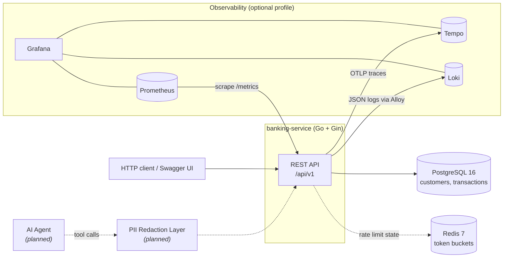
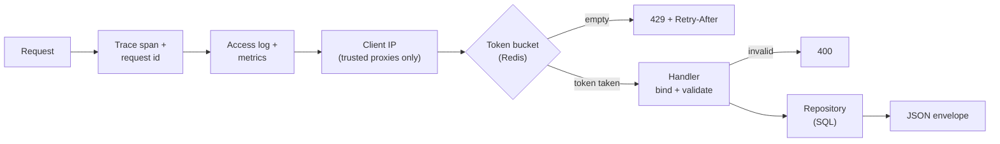
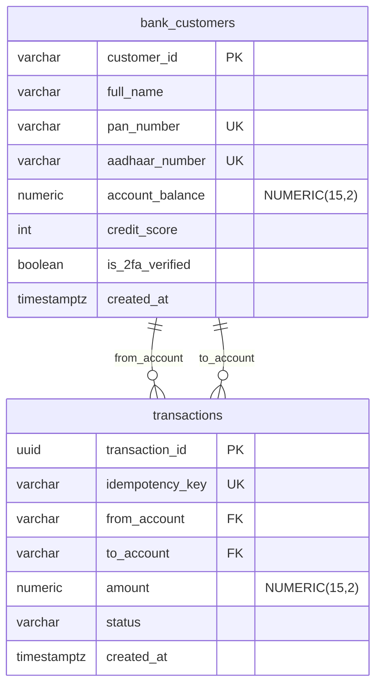

# Architecture

The platform is a core banking API meant to be called by an AI agent as a set of tools. Two properties shape every design choice:

- **Correct under retries and concurrency.** Agents retry after timeouts and issue calls in parallel.
- **PII stays out of the model.** Identity numbers must never reach an LLM.

## System context



| Component | Status | Role |
|---|---|---|
| `banking-service` | Built | REST API: profiles, transfers, loan evaluation |
| PostgreSQL 16 | Built | System of record |
| Redis 7 | Built | Token-bucket state for rate limiting. Nothing else depends on it |
| Prometheus, Loki, Tempo, Grafana, Alloy | Built | Metrics, logs, traces, dashboards and alerts. See [infrastructure](../infrastructure/README.md) |
| PII redaction layer | Planned | Strips PII again before data reaches an LLM |
| AI agent | Planned | Calls the API as tools |

## Request pipeline

Every `/api/v1` request passes through the same stages:



1. **Trace and request id.** OpenTelemetry starts a span (continuing an incoming `traceparent` if present), and an `X-Request-ID` is reused or generated. Both are attached to every log line written during the request.
2. **Access log and metrics.** One JSON log line and one latency sample per request, labelled by route template. A panic is recovered here and still counted as a `500`.
3. **Client IP.** Taken from the TCP connection. `X-Forwarded-For` is honoured only from proxies listed in `TRUSTED_PROXIES`, so clients can't spoof an IP to escape rate limits.
4. **Rate limit.** One token per request from the client's bucket for that endpoint group ([ADR 0006](decisions/0006-token-bucket-rate-limiting.md)).
5. **Handler.** Binds JSON, validates fields and amounts, and maps domain errors to status codes.
6. **Repository.** All SQL, each statement traced as a child span. Transfers run as one database transaction ([ADR 0001](decisions/0001-atomic-transfers-with-ordered-locking.md)).
7. **Envelope.** Every response, including errors, goes through `internal/response` and has the same `{status, message, success, data}` shape.

## Code layout

```
services/banking-service/
├── cmd/main.go             wiring: config, connections, routes, middleware
└── internal/
    ├── accounts/           profile lookup, PII masking
    ├── transactions/       atomic, idempotent transfers
    ├── loans/              eligibility rules (pure function) + handler
    ├── ratelimit/          token bucket (Redis + Lua), Gin middleware
    ├── observability/      logging, metrics, tracing, request ids
    ├── money/              exact decimal validation and maths
    ├── response/           JSON envelope helpers
    ├── config/             .env loading, settings
    ├── health/             Postgres + Redis checks
    └── db/                 connection pool
```

Conventions:

- **Domain packages** (`accounts`, `transactions`, `loans`) each have a *repository* (SQL only) and a *handler* (HTTP only).
- **Business rules are pure functions** with no I/O, so they're unit tested without a database: `loans.Evaluate`, `accounts.MaskPAN`, `money.Valid`.
- **`loans` depends on an interface** (`CustomerGetter`), not on `accounts`' concrete repository.
- **Handlers take middleware at registration** (`RegisterRoutes(rg, middleware...)`), so `main.go` decides which rate limit applies where.

## Data model



- The schema is in [`database/migrations/001_init.sql`](../database/migrations/001_init.sql). Postgres applies it the first time the container starts with an empty volume.
- `idempotency_key UNIQUE` is what makes transfers safe to retry ([ADR 0002](decisions/0002-idempotency-keys.md)).
- Only settled transfers are stored. Failed attempts leave no row.

## Security boundaries

**PII is protected twice**, so one bug doesn't expose raw identity numbers:

1. **The API masks PII** ([ADR 0004](decisions/0004-mask-pii-at-the-api.md)). The repository returns `accounts.Customer` with raw values, but handlers only ever serialise `accounts.Profile`, which is always masked.
2. **The redaction layer (planned)** strips PII again before anything reaches an LLM.

Other protections:

| Protection | How |
|---|---|
| No secrets in code | Credentials come only from `.env` (git-ignored). The service refuses to start without them |
| No internal details in errors | `500` responses are generic; causes are logged server-side |
| Abuse limits | Per-client token buckets, spoof-proof client IP |
| No PII in telemetry | SQL spans omit parameter values; PAN and Aadhaar are never logged; customer ids never become metric labels |
| Hardened container | Distroless image, non-root, read-only filesystem, all capabilities dropped |
| Input validation | Length limits on ids and keys; strict amount format |

**Not yet built:** authentication and authorisation. Anyone who can reach the API can call it for any account. This is the biggest gap before real use.

## Failure modes

| What fails | What happens | Why |
|---|---|---|
| Postgres unreachable at startup | Service exits with an error | No point serving requests without the system of record |
| Postgres down at runtime | Requests return `500`; `/health` returns `503` | Load balancers can take the instance out of rotation |
| Crash or error mid-transfer | Postgres rolls the transaction back | Nothing is committed until every step succeeds |
| Client times out and retries | Original transaction returned, no second transfer | Idempotency key |
| Redis unreachable at startup | Warning logged, service starts | Rate limiting fails open |
| Redis down or slow at runtime | Requests allowed after at most 100 ms; `/health` reports `"redis": "down"` | A limiter outage must not take banking down. The trade-off is no rate limiting until Redis recovers |
| Required setting missing | Service refuses to start and names the variable | Fail fast rather than run misconfigured |
| Tempo down | Spans are dropped; a warning is logged | Tracing must never affect request handling |
| Loki or Alloy down | Logs still go to stdout; they're missing from Loki for that period | The service doesn't depend on its log pipeline |
| Container stopped (`SIGTERM`) | Stops accepting requests, finishes in-flight ones (10 s max), flushes traces | No request is cut off mid-transfer by a deploy |

## Concurrency model

Transfers are the only operation that writes, so they carry the concurrency guarantees:

- **Row locks** on both accounts, taken in `customer_id` order to prevent deadlocks.
- **The idempotency check runs after locking**, so a racing retry waits and then sees the committed original.
- **The `UNIQUE` constraint** is the final guard for the one race the check can't see.

Verified by integration tests: 20 identical concurrent requests produce one transfer; 100 concurrent opposite-direction transfers don't deadlock; 20 concurrent debits against a ₹500 balance allow exactly 5. Details: [ADR 0001](decisions/0001-atomic-transfers-with-ordered-locking.md), [ADR 0002](decisions/0002-idempotency-keys.md).

Rate limiting is also concurrency-safe: the Lua script refills and takes a token in one atomic Redis operation.

## Decisions

| ADR | Decision |
|---|---|
| [0001](decisions/0001-atomic-transfers-with-ordered-locking.md) | Atomic transfers with ordered locking |
| [0002](decisions/0002-idempotency-keys.md) | Idempotency keys for transfers |
| [0003](decisions/0003-deterministic-loan-rules.md) | Deterministic loan rules, no LLM |
| [0004](decisions/0004-mask-pii-at-the-api.md) | Mask PII at the API layer |
| [0005](decisions/0005-exact-decimal-money.md) | Exact decimal money, no floats |
| [0006](decisions/0006-token-bucket-rate-limiting.md) | Token bucket rate limiting in Redis |
| [0007](decisions/0007-observability-stack.md) | Observability with OpenTelemetry and the Grafana stack |
