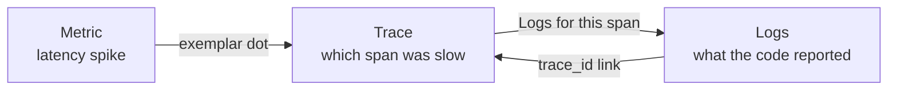

# Infrastructure

Everything needed to run the platform in Docker and watch it: the service image, the Compose stack, and a full observability stack (metrics, logs, traces, dashboards, alerts).

```
infrastructure/
├── docker/
│   ├── compose.yml                    postgres, redis, banking-service
│   └── banking-service/Dockerfile     multi-stage, distroless, non-root
└── observability/
    ├── compose.yml                    prometheus, grafana, loki, tempo, alloy, exporters
    ├── prometheus/
    │   ├── prometheus.yml             scrape targets
    │   └── rules/banking-service.yml  alert rules
    ├── grafana/
    │   ├── provisioning/              datasources (with cross-links), dashboard provider
    │   └── dashboards/                banking-service.json
    ├── loki/loki.yml                  log storage
    ├── tempo/tempo.yml                trace storage, OTLP receiver
    └── alloy/config.alloy             ships container logs to Loki
```

The repo-root `docker-compose.yml` only `include`s these two compose files. Settings come from the repo-root `.env`.

## Running

From `bank-agent-platform/`:

| Command | Starts |
|---|---|
| `make up` | Postgres + Redis (enough for `make run`) |
| `make up-app` | + banking-service in a container |
| `make up-observability` | + the observability stack |
| `make up-all` | Everything |
| `make down` | Stops everything. Data volumes are kept |
| `make logs` | Follows the service container's logs |

Or with Compose directly from the repo root: `docker compose --profile app --profile observability up -d --build`.

The containerised service and `make run` both use port 8001, so run one or the other.

## URLs

| What | URL | Notes |
|---|---|---|
| Grafana | http://localhost:3000 | Opens on the Banking Service dashboard. Anonymous users can view; log in as `admin` / `GRAFANA_ADMIN_PASSWORD` to edit |
| Prometheus | http://localhost:9090 | Queries, targets, alert rules (`/alerts`) |
| Tempo | http://localhost:3200 | Query through Grafana's Explore |
| Loki | http://localhost:3100 | Query through Grafana's Explore |
| Alloy | http://localhost:12345 | Log pipeline status |
| banking-service | http://localhost:8001 | `/metrics` for raw metrics |

## The service image

`docker/banking-service/Dockerfile`:

- **Two stages.** A Go build stage produces a static binary; the runtime stage is `distroless/static`, with no shell and no package manager. The image is about 51 MB.
- **Hardened.** Runs as `nonroot`. Compose adds a read-only filesystem, drops all Linux capabilities and sets `no-new-privileges`.
- **Health check without curl.** `banking-service healthcheck` calls its own `/health`; Docker runs it every 10 seconds.
- **Graceful shutdown.** On `SIGTERM` it stops taking requests, finishes in-flight ones (up to 10 seconds) and flushes pending traces.
- **Version stamping.** `--build-arg VERSION=v1.2.3` shows up in logs and in the `banking_service_build_info` metric.

## What is collected

### Metrics (Prometheus)

Scraped every 15 seconds from `/metrics`:

| Metric | Labels | Meaning |
|---|---|---|
| `http_requests_total` | method, route, status | Requests. `route` is the template (`/api/v1/accounts/:id/profile`), never the raw path |
| `http_request_duration_seconds` | method, route | Latency histogram, with trace-id exemplars |
| `http_requests_in_flight` | | Requests being served now |
| `transfers_total` | outcome | `settled`, `replayed`, `insufficient_funds`, `account_not_found`, `idempotency_conflict`, `invalid`, `error` |
| `transfer_amount_rupees_total` | | Rupees moved by settled transfers |
| `loan_evaluations_total` | reason | `ELIGIBLE`, `LOW_CREDIT_SCORE`, ... |
| `ratelimit_decisions_total` | rule, decision | `allowed`, `rejected`, `error` (Redis down, failed open) |
| `db_pool_*` | | Connection pool usage and waits |
| `go_*`, `process_*` | | Go runtime, CPU, memory |
| `banking_service_build_info` | version, go_version | Which build is running |

Plus `pg_*` from postgres-exporter and `redis_*` from redis-exporter.

### Logs (Loki)

The service writes one JSON object per line. Every line logged during a request carries `request_id`, and `trace_id` / `span_id` when the request is traced:

```json
{"time":"...","level":"INFO","msg":"transfer settled","transaction_id":"3771dfcf-...","from_account":"customer-001","to_account":"customer-002","amount":"200.00","request_id":"a3f9c2e1b7d04e55","trace_id":"060b1b9e9f8063be773d6df022063d12","span_id":"..."}
```

Alloy collects the logs of this project's containers (`bank-*`) and sends them to Loki. For the service, `level` becomes a label, and `trace_id` and `request_id` become structured metadata, so these queries work:

```logql
{service="banking-service", level="ERROR"}
{service="banking-service"} | trace_id="060b1b9e9f8063be773d6df022063d12"
{service="banking-service"} | request_id="agent-call-42"
```

Logs reach Loki only when the service runs in a container. With `make run` they go to your terminal (set `LOG_FORMAT=text` for readability).

**What is never logged:** PAN, Aadhaar, and SQL parameter values.

### Traces (Tempo)

OpenTelemetry traces every API request, with child spans for each SQL statement (`BEGIN`, `SELECT ... FOR NO KEY UPDATE`, `UPDATE`, `INSERT`, `COMMIT`) and each Redis call (the rate-limit script). A transfer is typically 10 spans.

- SQL spans contain the statement text, **never the parameter values**, so no customer data reaches Tempo.
- `/health` and `/metrics` are not traced, so Docker's health checks don't flood Tempo.
- Incoming W3C `traceparent` headers are honoured, so a trace can start in the AI agent and continue into this service.
- The containerised service always sends traces to Tempo. With `make run`, set `OTEL_EXPORTER_OTLP_ENDPOINT=http://localhost:4317` in `.env`.

## From a symptom to the cause

The three signals are linked in Grafana, so you can move between them without copying ids:



1. On the **Latency** panel, click an exemplar dot: it opens the trace of that exact request.
2. In the trace, click **Logs for this span** to see the log lines that request wrote.
3. From any log line in Explore, the `trace_id` field has a **View trace** link.

A client-supplied `X-Request-ID` (for example, the agent's tool-call id) is echoed back and attached to every log line, so you can find a specific call with `| request_id="..."`.

## Dashboard

**Banking Service** (Grafana home):

| Row | Panels |
|---|---|
| Overview | Request rate, 5xx error rate, p99 latency, transfers settled, money moved, rate-limited requests |
| Traffic | Requests by route, latency percentiles with exemplars, responses by status, p99 by route |
| Business | Transfers by outcome, money per minute, loan decisions, rate-limiter decisions |
| Dependencies | Postgres and Redis up, pool size and waits, Postgres connections, Redis memory and keys, running version |
| Go runtime | Goroutines, heap, CPU |
| Logs | Live service logs, filterable by level |

The dashboard is provisioned from `grafana/dashboards/banking-service.json`, which is the source of truth. Edits made in the UI can be overwritten by the file when Grafana restarts, so export the JSON back into the file to keep them.

## Alerts

Defined in `prometheus/rules/banking-service.yml` and visible at http://localhost:9090/alerts:

| Alert | Fires when | Severity |
|---|---|---|
| `BankingServiceDown` | No successful scrape for 1 minute | critical |
| `HighErrorRate` | More than 5% of requests return 5xx for 5 minutes | critical |
| `TransferErrors` | Any transfer fails with an internal error | critical |
| `PostgresDown` | postgres-exporter can't reach Postgres for 1 minute | critical |
| `HighLatencyP99` | p99 above 500 ms for 10 minutes | warning |
| `RateLimiterFailingOpen` | The limiter couldn't reach Redis and allowed requests unlimited | warning |
| `RedisDown` | redis-exporter can't reach Redis for 1 minute | warning |
| `DatabasePoolSaturated` | Pool over 90% used for 5 minutes | warning |
| `IdempotencyConflicts` | More than 5 key conflicts in 15 minutes (likely a client bug) | warning |

Alerts are evaluated but **not delivered anywhere yet**. Sending them to Slack, email or PagerDuty needs an Alertmanager; see below.

## Retention

Prometheus, Loki and Tempo each keep **7 days** of data in named Docker volumes (`prometheus_data`, `loki_data`, `tempo_data`, `grafana_data`). `make down` keeps them; `docker compose down -v` deletes them, **including the Postgres data**.

## Before production

This setup is built for local development and demos. For production:

- **Alert delivery:** add Alertmanager and route alerts to an on-call channel.
- **Storage:** Loki and Tempo use local disk here. Use object storage (S3, GCS) and run them in their scalable modes, or use a managed service.
- **Access:** `/metrics` is served on the public API port. Put it behind the internal network or a separate port. Turn off anonymous access in Grafana and set a strong admin password.
- **Sampling:** every request is traced. At high traffic, set `OTEL_TRACES_SAMPLER=parentbased_traceidratio` and `OTEL_TRACES_SAMPLER_ARG=0.1` (10%).
- **Secrets:** use Docker or Kubernetes secrets instead of a `.env` file.
